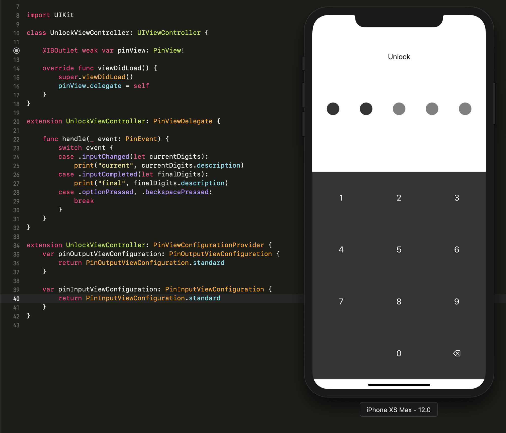
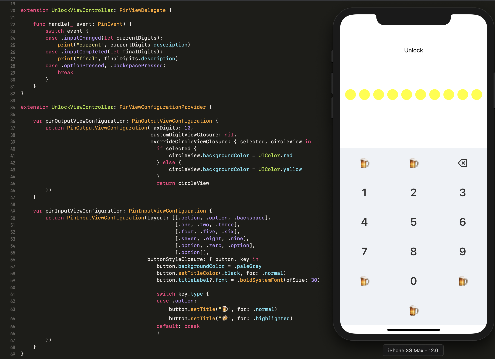

# SwiftPin

## Features

This project aims at providing a PinView that is configurable for multiple use cases.

Currently it supports:

- pin length can be configured
- keyboard button can be configured
- pin digit view can be configured
- pin digit view's dot view can be configured
- keyboard layout can be configured

## Installation
```
pod 'SwiftPin', :git => 'https://github.com/0xPr0xy/SwiftPin.git'
```

## Usage

In your view controller xib file,
Add a view and add constraints for it's size.
Then set it's class to `PinView` and connect it to your ViewController:

```
@IBOutlet weak var pinView: PinView!
```

Import the library:

```
import PinView
```

Then set the ViewController as it's delegate:

```
pinView.delegate = self
```

Implement the PinViewDelegate protocol:

```
extension UnlockViewController: PinViewDelegate {

    var clearInputOnCompleted: Bool { return false }

    func handle(_ event: PinEvent) {

    }
}
```

Implement the PinViewConfigurationProvider protocol:

```
extension UnlockViewController: PinViewConfigurationProvider {

    var pinInputViewConfiguration: PinInputViewConfiguration {
        return PinInputViewConfiguration.standard
    }
    var pinOutputViewConfiguration: PinOutputViewConfiguration {
        return PinOutputViewConfiguration.standard
    }
}
```

## Screenshots

Standard



Custom


